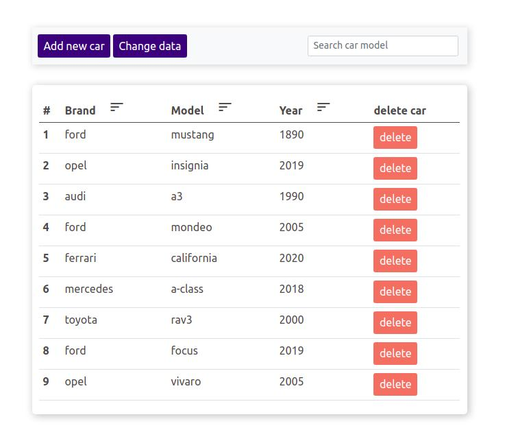
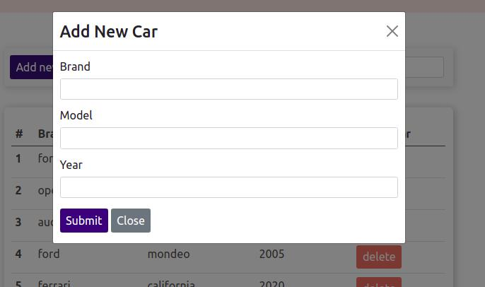

# invisio-interview-app

### tools used in project:
- html
- css
- javascript
- bootstrap 5

### app view

### you can sort by:
- model column
- brand column
- year column

### a searching by model of car:

### modal buttons open the same modal window with different content inside:

